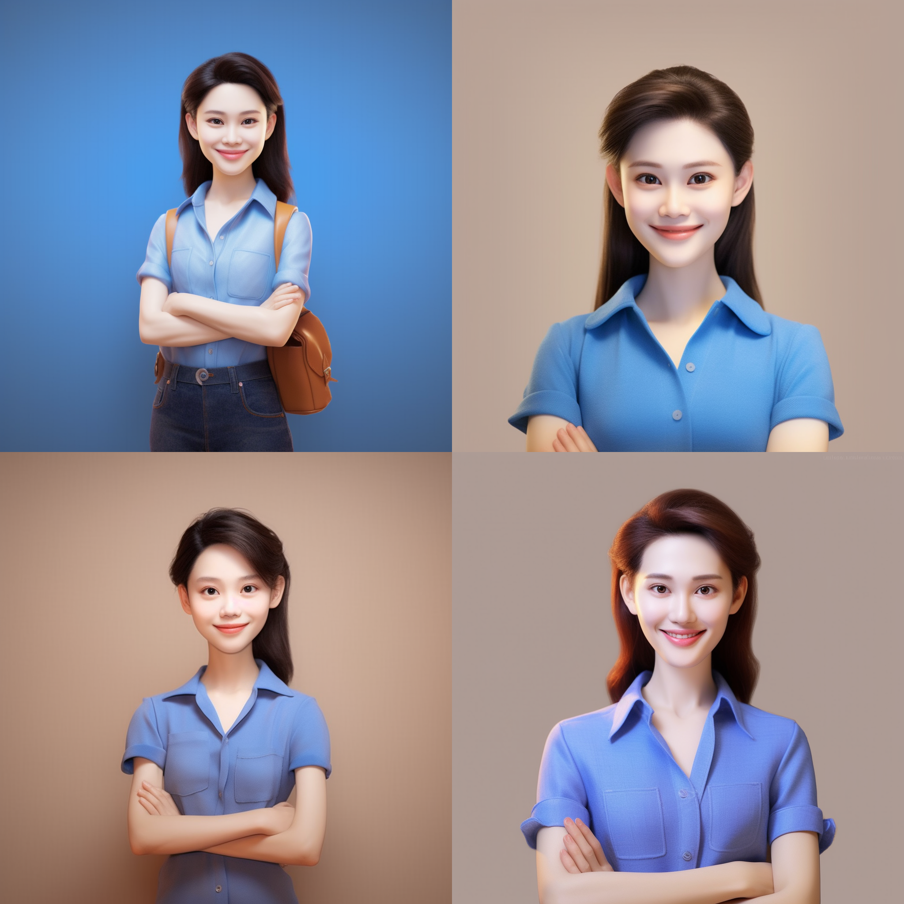
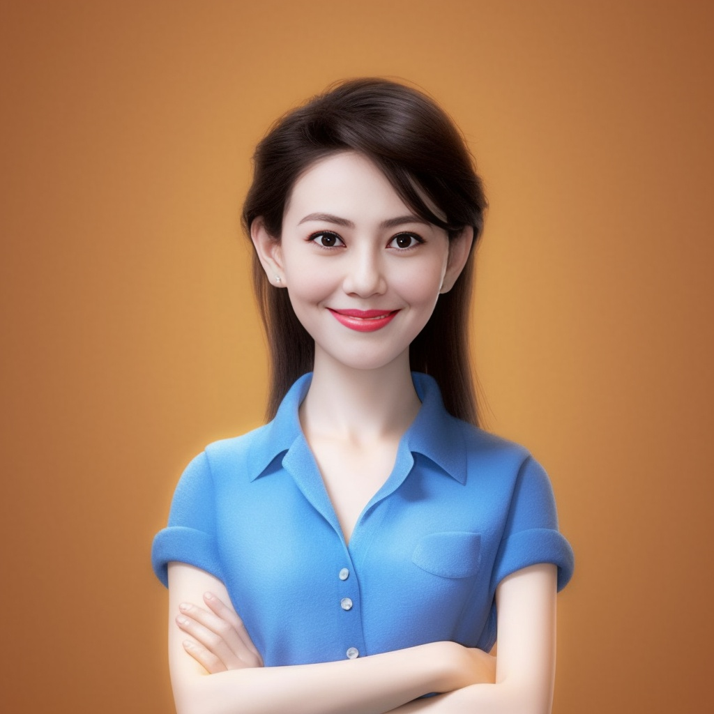

# MidjourneyApi
use discord and Midjourney imagine command and swapface mode to get a cartoon IP

source image:

result image:

<!-- Adds  image size syntax support to VS Code's built-in Markdown preview. -->