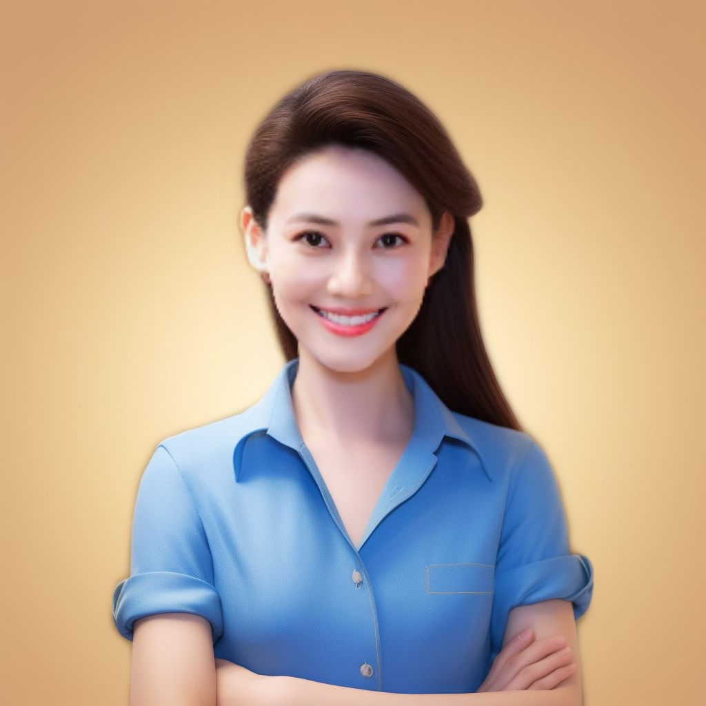

# MidjourneyApi
Use discord API and Midjourney imagine command with swapface optional to get a cartoon IP.

## set discord authorization and pay_load
1. open url: https://discord.com/ and login
2. send a command to midjourney bot: fom example, `/imagine prompt amazing`
3. copy response Header: Authorization, Payload: payload_json, paste to discord/config.py
4. then run main.py, you can get a 3d rendering cartoon charactor in images folder.

## samples

source image:

result image:

result image:

result image with swapface:

<!-- Adds  image size syntax support to VS Code's built-in Markdown preview. -->